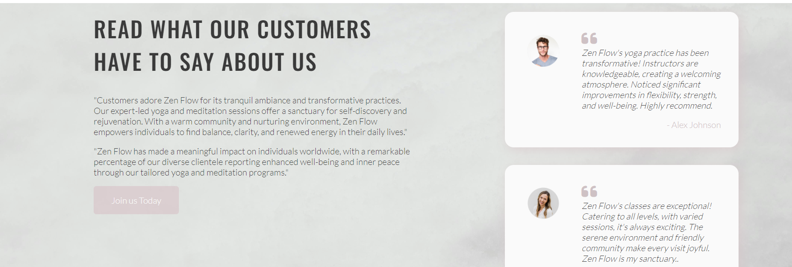

Zen-Flow

A website built about Yoga in the Local Area. Users can easily access the website to sign up to classes that Zen Flow has to offer. 

Chantal Shepherd 

LIVE SITE
https://chantalshepherd.github.io/zen-flow/

------------------------------------------------------------------

GIT HUB REPOSITORY
https://github.com/ChantalShepherd/zen-flow.git

------------------------------------------------------------------
  
TABLE OF CONTENTS

 1. [ UX ](#ux)
 2. [ Features ](#features)  
 3. [ Features Left to Implement ](#left)  
 4. [ Technology used ](#tech) 
 5. [ Testing ](#testing)  
 6. [ Bugs ](#bugs)  
 7. [ Deployment](#deployment)
 8. [ Credits](#credits)
 9. [ Content](#content)  
 10. [ Acknowledgements](#acknowledgements)  

UX
### Pre-project Planning

When deciding on this project i knew i wanted to create my website based around wellness. I had to figure out which website would have the most growth and traffic of customers. This was between Yoga, Meditation or Mindfulness.

I saw this as an opportunity to craft an intuitive and visually engaging platform that promotes health and balance. 

I came to the conclusion that the best path forward would be to build a Service website about Yoga.

This above preplanning helped me to determine the type of project & industry to build for.

### Strategy Plane
User
- As a user I want to be able to find a wellness centre that caters to all types of yoga.  
- As a user I want to be able to signup to classes straight online.
- As a user I want to be able to see evidence of the merchants work & read testimonials as proof.  
- As a user I want to be able to find out when and where the classes ran.

Business Owner
- As the site owner I want to be able to showcase my business to prospective customers.  
- As the site owner I want to build trust and showcase details of classes that i have conducted.  
- As the site owner I want to create leads and provide customers a way to sign up online. 

### Scope Plane
- The website should have a Navigation menu that is consistent across all pages and devices.  
- The website should have a welcome message for the user explaining to them who we are and what we do.  
- The website should neatly and appropriatly list the membership plans we provide to the user.  
- The website should give the user proof of work completed through testimonials.  
- The website should give the user a way to signup through a form. 
- The website should give the user more contact via a physical address.

## Structure Plane
- To acheieve the goals of the above the website should include at least 4 pages consisting of:  Home, About, Membership and Signup.  

**Home Page**
- Navigation with links  
- Queen welcome message with call to action to take user to signup form.  
- Information regarding various classes provided with images. 
- Explanation of the benefits of Yoga.
- Testimonials showcasing reviews and work completed from users of this business.
- Footer section with adress of the business along with links to the businesses social media pages.

**About Page**
- Queen welcome message with call to action to take user to signup form.  
- Showcases blog posts.
- Owner testimony message to inspire users.
- Gallery of images of classes taken place. 
- Footer section with adress of the business along with links to the businesses social media pages.

**Membership**
- Queen welcome message with call to action to take user to signup form. 
- Cards displaying prices of different memberships. 

**SignUp**
- A form for the user to sign up to yoga classes.  
- The form should collect contact details for the customer so that the merchant can contact them back.
- The form should include an option for the user to select if they want to choose a membership. 
- The form should include information that gives the user a choice of selecting a type of wellness they are interested in which will give usueful data to the merchant.
- The contact form should give user feedback on submission.

## Skeleton Plane

### Home Page Desktop Image

### Home Page mobile Image

- The design flow in this website was meant to showcase a balanced minimal design that provided relevant information in a concise format on all devices.  
- As the project was created, the intial design did not provide the flow that was expected in the pre project stage. The project was then adapted to help with this during development.  
- The color theme was taken from the queen pictures t-shirt and use of these pastel colors was used throughout the other pages on the website to create fluidity and consistency. 
- Additional color came from banners,and images to create contrast.  

## Surface Plane

### Color

- I decided the best approach to this website was an attempt at minimilistic design with rare pops of colour. Most other websites of this industry had either gone for too much in terms of design or too little and just provide a very poor user experience.

- The decision was to stick with these set colors for the base 

 - #fafa - Off White
 - rgba(216, 198, 202, .7) - light pastel pink
 
And the occasional use of the below colors to create a subtle contrast.

- rgba(186, 168, 172, 0.7) -medium pastel pink
- rgba(60, 60, 60, 0.6) - dark pastel pink
- #3a3a - dark grey

-Most additional color came through the images with the exception being the Queen Overlay, banners and the Sign Up form.

### Typography - 

-The font's chosen for this project were:

 - Oswald
 - Lato
 - Sans Serif

- The rationale was that I wanted all of the information provided on the website to be clear, concise and without any unnecessary distractions. 
- My focus was to also assist with users who may have visual impairments.

## Features

#### Home Page

#### Navigation Bar

- Navigation Bar developed using Flex and contains 4 links to each page home, about, membership and signup.
- Used across all pages. 

#### Hero Section

- Image with a box overlay with Call to action link stating 7 day free trial. This link will take the user to the sign up form on signup.html.
- Used across all pages.

#### Benefits Section

- Image of woman practicising yoga. 
- Description of why yoga is beneficial to entice customers to join. 

#### Benefits Section

- Image of woman practicising yoga. 
- Description of why yoga is beneficial to entice customers to join. 

#### Icon Banner Section

- Small icons. 
- Description of what the site can offer to customers. 

#### Gallery Section

- Collage of pictures displayed in 2 rows showcasing types of yoga on offer. 
- Button in centre of image displaying names of different types of yoga. 

#### Classes Section

- Image of woman as background image. 
- Description of yoga classes available.  

#### Banner Section

- Added banners to the home and about page to use up unwanted white space through use of icons from flaticon (https://www.flaticon.com/search?word=strength), text and gradient color. 
- Description of data display in linear columns. 

#### Reviews Section

- 3 image card with testimonials of customer reviews. 
- A card displaying information and signup link . 
- General card idea was based around others I have seen and used on modern websites. Then i styled it to how i wished the site to look. 
- I edited images took from pexels (https://www.pexels.com/) on canva (https://www.canva.com/) to achieve my desired results for the authors. 

#### Footer Section

- Displayed across all pages
- Shows social media links to client social media pages.
- Address of client business and copyrighting displayed. 

#### About Section

-Same nav bars.
-Same hero page just displaying different image for versatility.

#### Blog Section

-3 cards displaying images, dates and information on relevant posts regarding yoga and wellness.

#### Author Section

-banner of client testimony towards potential customers.

#### Gallery 2 Section

- collage of images to break up the page showcasing various yoga poses.

#### Membership Page

#### Membership Section

-same as the other pages just different image to create versatility.
- This was initially a gallery page but i felt it didnt suit the website flow. I changed it to a membership page to give users more information about what services were on offer.

#### Pricing Section

- I used a card format to display pricing of memberships.  

#### Signup Page

- same use of nav bar across all pages.
- different background image.
- signup form colored to contrast with background image. 

#### Response Page 

- same use of nav bar across all pages.
- different background image.
- short and sweet thankyou message after signup.

### Images

- Use of images was carefully selected from the website pexels (https://www.pexels.com/) to fit in a square, vertical or horizontal position. 
- This was showcased throughout the wesbite to provide a better user experience. 

### Home

https://chantalshepherd.github.io/zen-flow/index.html

- The home page was coming across very bland with alot of white space. So i added more different types of elements to make it more original using cards, and banners. 

#### About

https://chantalshepherd.github.io/zen-flow/gallery.html

- The about section was initially intended to be a page about the bio of a few of the trainers with image, author name below and social media links. As the project progressed I decided to reduce this section for now as editing and fining the images proved impossible.

#### Membership

https://chantalshepherd.github.io/zen-flow/classes.html

- The membership section was originally intended to be a gallery page displaying images in a collage format, i struggled severly with this and felt the users were lacking pricing information. So i completely overhauled the whole page to include this.

#### Signup Form

https://chantalshepherd.github.io/zen-flow/signup.html

- I felt it was missing a drop down menu for the mememberships so i included this as an extra element.I also felt that with the use of text inputs, drop down menus and radio buttons helped keep the form interesting for user experience.   

- I also like the contrast of color of the form and the background image. I did at the start have a different image which displayed an elderly lady holding a yoga mat which i loved, as i felt it created diversity towards users. I didnt want the website to be based around women as i had chosen pastel pinks shades for color and this image matched perfectly. So i changed to a different one to accomodate. 

- This decision to forward to a new page was taken to improve user experience when using this project.

### Response Page

https://chantalshepherd.github.io/zen-flow/response.html?first_name=Chantal&last_name=shepherd&email_address=crshepherd1990%40gmail.com&telephone_number=0834551659&membership_preference=disabled+selected&wellness_preference=meditation

-I wanted a bright coloured background image still using yoga as the main element, to give customers a eureka moment still in keeping with the wellness theme of the website.

### Home page

- If i had more time i would of added more elements to the landing page to engage users more and include javascript to make it more animated with elements appearing via sliding in just like powerpoint for microsoft.
- I would of liked to included a link image to the logo on every pages header. 

### About Page

- In the future I would like to add more text describing the business. Alos adding a breakdown of all the trainers at the business. Including their name, image, and social media links. 

### Membership Page

- I would of liked to add a feature to the cards that when the user clicked on each card it would turn over and display more information. 

### SignUp Page

- I initially used the code institute default from Love Running. Thankfully i made a simple version of this form in time. As this is a crucial aspect for any business to recieve data from their interactive users i would make it slighlty more complex to gather more data where necessary.  

### Response Page

- I would add more interactive elements to make the congratulations more enegaging. 

### Additional Page ideas

- I would like to add a chat bot feature so customers could ask more about the classes that they wished to sign up to.
- I would use javascript throughout my website to make it more animated. 
- I would add more pages to include other wellness options such as meditation and breathwork workshops to increase revenue for the business.

# Technology Used

### Html
- Used to structure my webpages and the bones of my web project.

### CSS
- Used to style and add layout to my project.
- Grid and Flexbox properties were used to help make the page responsive.

### Font Awesome & Flaticon
- Used for all the icons in this project.

### GoogleFonts
- Used for all the fonts used in this project and to compare potential fonts.

### Canva
- Used to edit images throughout the project when needed.

### Convertio
- Used to convert img files from png to webp to reduce size and improve web loading speed.

### Github
- Used to host the website during development.

### Gitpod
- Used to build the website and debug.

# Testing

- Testing on this project was done manually by myself.

- Test all links including sign up buttons, navigation bar areas and logo is working correctly - no errors
- Navigate effectictively through the site - no errors
- Images displayed correctly and not distorted - no errors

### Testing Phase

## Google Lighthouse Testing

- I used google lightouse testing to test the website for performance, acessibility, best practices and SEO. Below are links to my results.

### index.html

https://chantalshepherd.github.io/zen-flow/index.html

### gallery.html (About Page)

https://chantalshepherd.github.io/zen-flow/gallery.html

### classes.html (Membership Page)

https://chantalshepherd.github.io/zen-flow/classes.html

### signup.html

https://chantalshepherd.github.io/zen-flow/signup.html

### response.html

https://chantalshepherd.github.io/zen-flow/response.html?first_name=Chantal&last_name=shepherd&email_address=crshepherd1990%40gmail.com&telephone_number=0834551659&membership_preference=disabled+selected&wellness_preference=meditation

## HTML Validation

- I used NU html checker to validate my code. Most errors were displaying typos such as not closing div containers and spaces between attributes not being applied. If i had more time these would be simple fixes.
Below are my results.

### index.html

https://validator.w3.org/nu/?doc=https%3A%2F%2F8000-chantalshepherd-zenflow-ptk8914ze36.ws-eu110.gitpod.io%2Findex.html

#### Result: 6 errors. 3 info errors, these a suggestive not necesary.  

### gallery.html

https://validator.w3.org/nu/?doc=https%3A%2F%2F8000-chantalshepherd-zenflow-ptk8914ze36.ws-eu110.gitpod.io%2Fgallery.html

#### Result: 3 errors and 1 warning. Warning states section doesnt have a heading, page heading appears above and requires no additional content. 

### classes.html

https://validator.w3.org/nu/?doc=https%3A%2F%2F8000-chantalshepherd-zenflow-ptk8914ze36.ws-eu110.gitpod.io%2Fclasses.html

#### Result: 2 Errors. 

### signup.html

https://validator.w3.org/nu/?doc=https%3A%2F%2F8000-chantalshepherd-zenflow-ptk8914ze36.ws-eu110.gitpod.io%2Fsignup.html

#### Result: 4 Errors.

### response.html

https://validator.w3.org/nu/?doc=https%3A%2F%2Fchantalshepherd.github.io%2Fzen-flow%2Fresponse.html%3Ffirst_name%3DChantal%26last_name%3Dshepherd%26email_address%3Dcrshepherd1990%2540gmail.com%26telephone_number%3D0834551659%26membership_preference%3Ddisabled%2Bselected%26wellness_preference%3Dmeditation

#### Result: 1 warning, to use h1 element instead of h2, i disregarded this, i thought it was unecessary. 

## CSS Validation

### style.css

https://jigsaw.w3.org/css-validator/validator?uri=https%3A%2F%2F8000-chantalshepherd-zenflow-ptk8914ze36.ws-eu110.gitpod.io%2Findex.html&profile=css3svg&usermedium=all&warning=1&vextwarning=&lang=en

#### Result: 0 errors.

**Bugs**
There were a few bugs but these 3 were the most tricky.I still have a few errors which i couldnt seem to solve on each page but there was bugs before from 15 errors and i managed to get it down to below 10. 

CSS code displayed in main section. 
-Moved data out of main element. Output corrected.

Sign up form not displaying correctly.
- Removed absalute from display position. Output corrected.

Links had button elements in html displaying incorrectly and bad use of coding.
- Removed button from <a> attribute. Output corrected.

## Unsolved Bugs 

These were the 3 bugs i couldnt seem to solve, i tried googling to understand what it meant but got nowhere.
Stray end tag on head Element
Start tag body seen but an element of the same type was already open.
End tag footer seen, but there were open elements.

## Improvements 

-I would of liked to of made my website fully responsive but unfortunately that didnt happen. I will know from now on when developing to build from either desktop or mobile first and base my media queries around one specifically. I was limited on time and was afraid if i deleted/modified elements on the css page it would throw everything else off. I did try this method a few times and always returned a negative result.

-I would also like to change the about and memebrship pages to display these names instead of gallery and classes as thats what they were originally called. 

## Deployment

- To deploy the project I followed these steps starting from the main project repository [here] (https://github.com/ChantalShepherd/zen-flow.git)

 1. Clicked on `Settings` on the navigation menu in the repository
 2. I then selected the `Pages` menu on the side bar.
 3. In the first dropdown menu labeled `Source` I selected the branch of the name `main` from the dropdown.
 4. In the next dropdown labeled `/root` I left as the default option.
 5. Selected Save
 
- I then received a notification from GitHub that my project is being deployed and after about 1 minute & a couple of refreshes of the page it was ready and live.

## Credits

### All images sourced from pexels.com. 
[Pexels](https://www.pexels.com/)

## Content & Resources

### Pexels.com
- Images used in this project.

### w3 schools
- Used for general lookup for HTML and CSS synthax queries

### Code Institute
- Project created in line with course content and within project 1 scope.

### Font Awesome & Flaticon
- All icons used in the project sourced from these 2 sites.

## Acknowledgements

### Alan Bushell & Luliia Konovalova
- My mentor who provided me with constructive feedback and positive reinforcement where applicable.